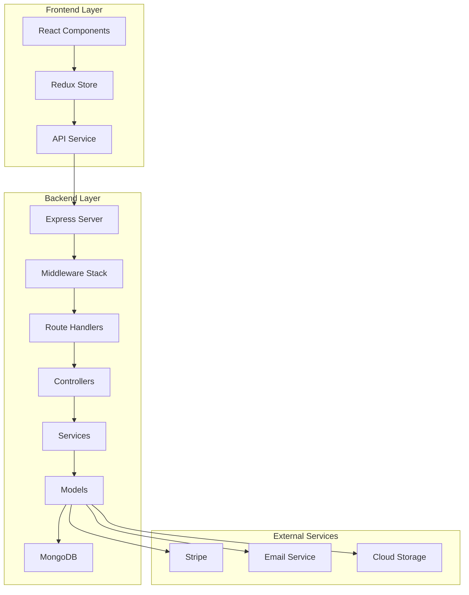
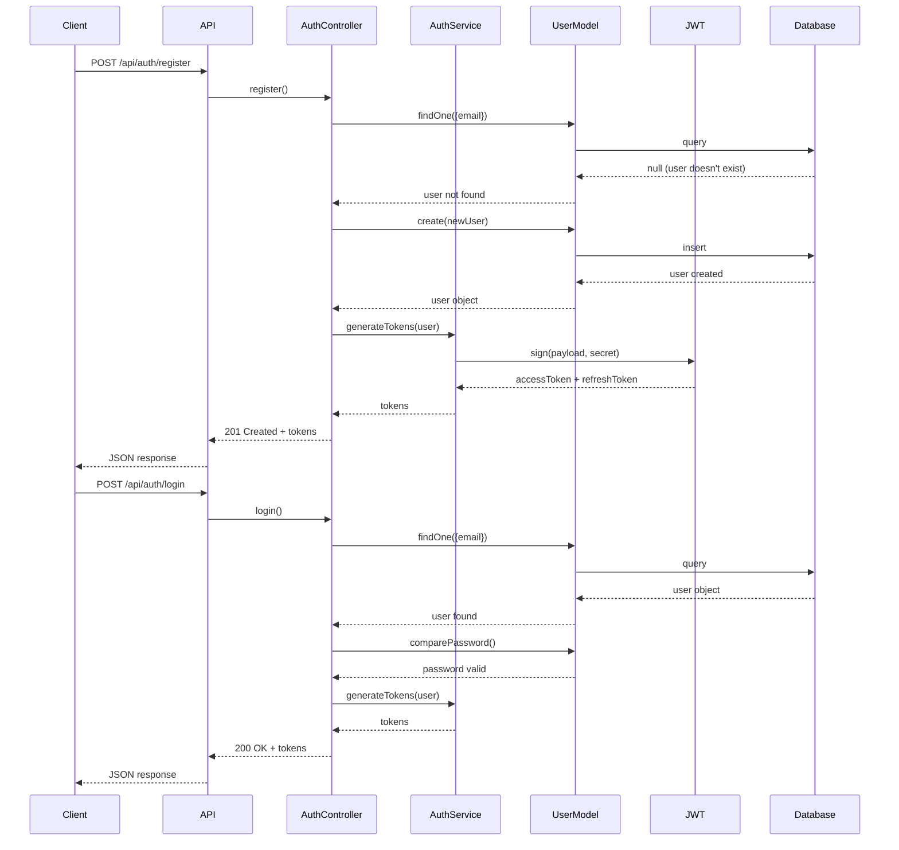
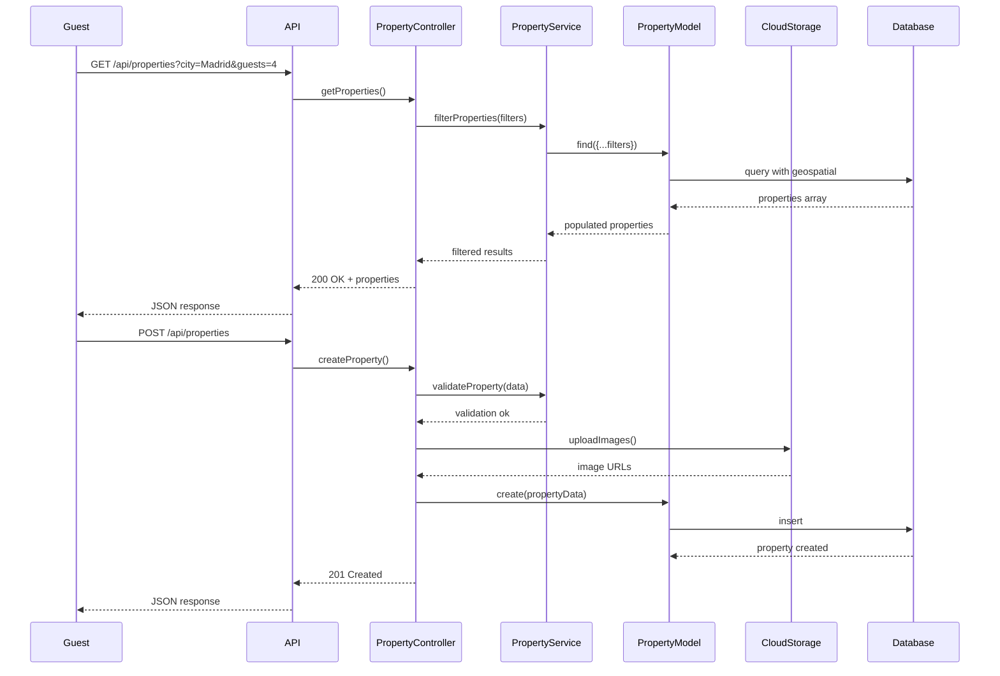
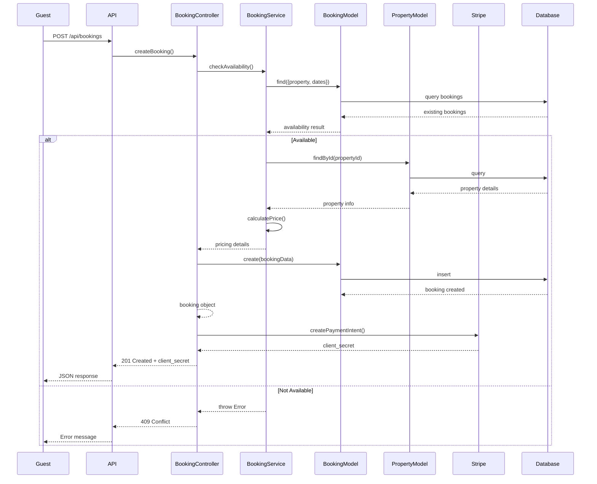
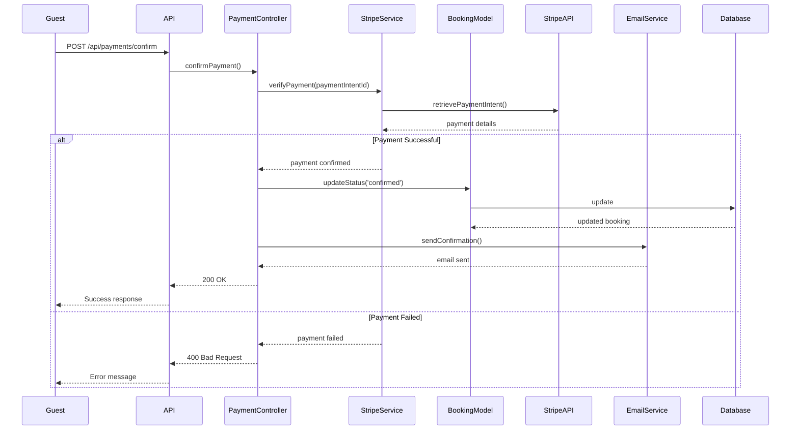
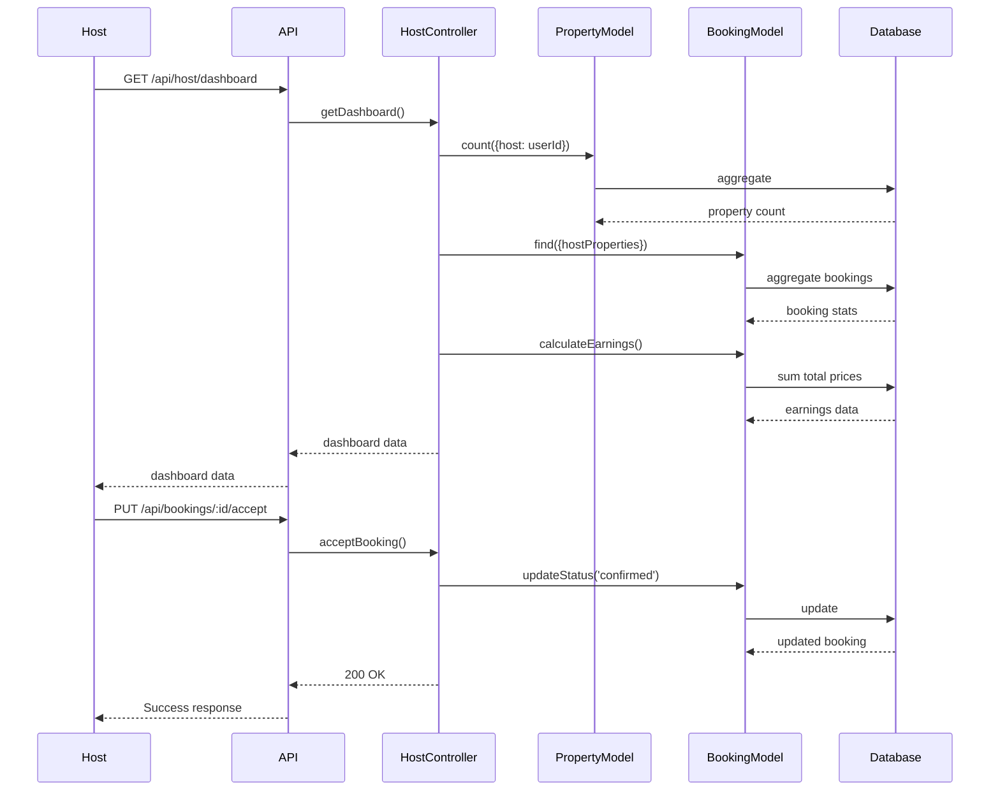
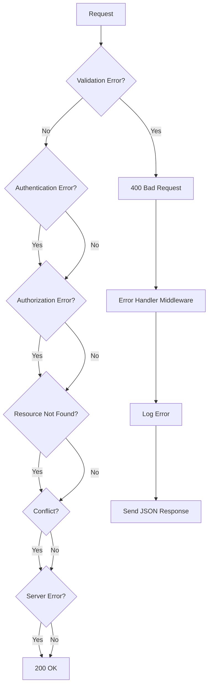
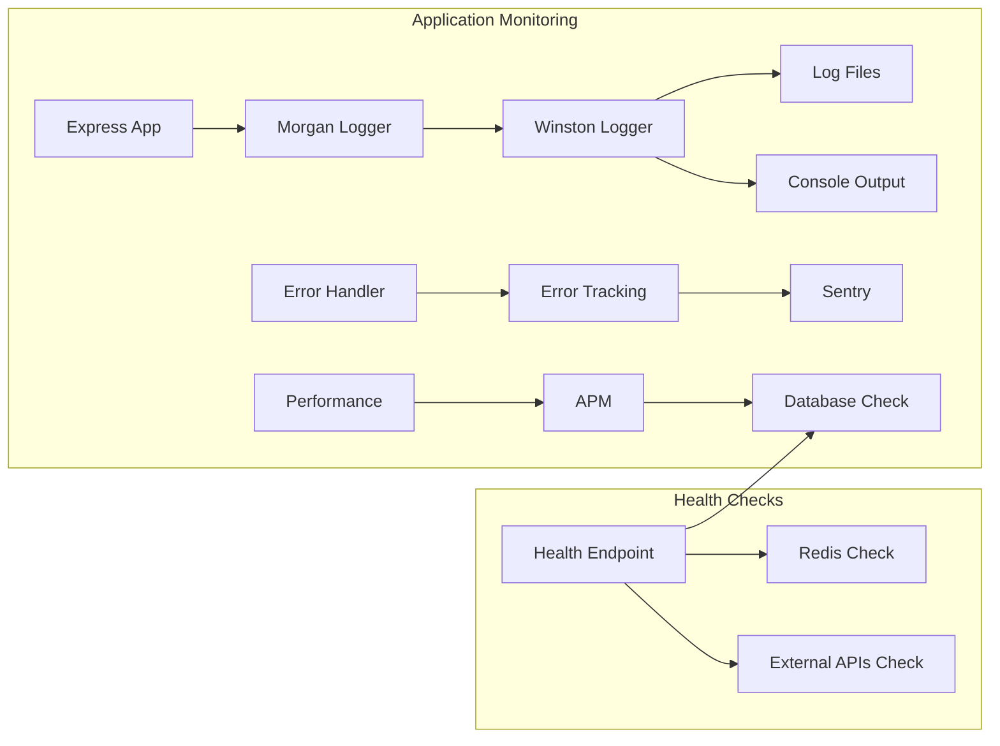

# 🎯 DIAGRAMA DE FLUJO COMPLETO - BACKEND AIRBNB CLONE

## 🔄 FLUJO GENERAL DEL SISTEMA

---

## 🔐 FLUJO DE AUTENTICACIÓN

---

## 🏠 FLUJO DE PROPIEDADES

---

## 📅 FLUJO DE RESERVAS

---

## 💳 FLUJO DE PAGOS

---

## 🏗️ FLUJO DE HOST DASHBOARD

---

## 🔄 FLUJO DE ERRORES

---

## 📊 FLUJO DE DATOS COMPLETO

---

## 🎯 RESUMEN DE FLUJOS POR CAPA

### **1. Capa de Presentación (Frontend)**
- **Componentes React** → **Redux Store** → **API Service**

### **2. Capa de API (Backend)**
- **Express Routes** → **Middleware** → **Controllers**

### **3. Capa de Servicios**
- **Business Logic** → **External APIs** → **Data Processing**

### **4. Capa de Datos**
- **MongoDB Models** → **Redis Cache** → **File Storage**

### **5. Capa de Infraestructura**
- **Docker Containers** → **Load Balancer** → **CDN"
